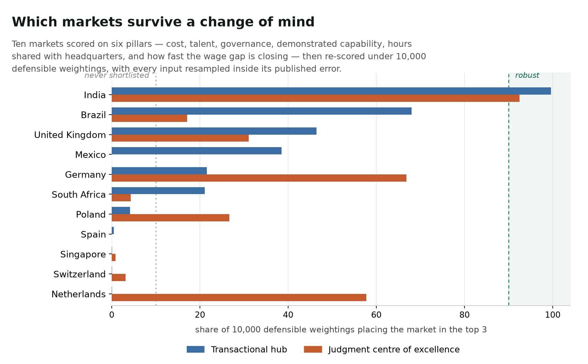
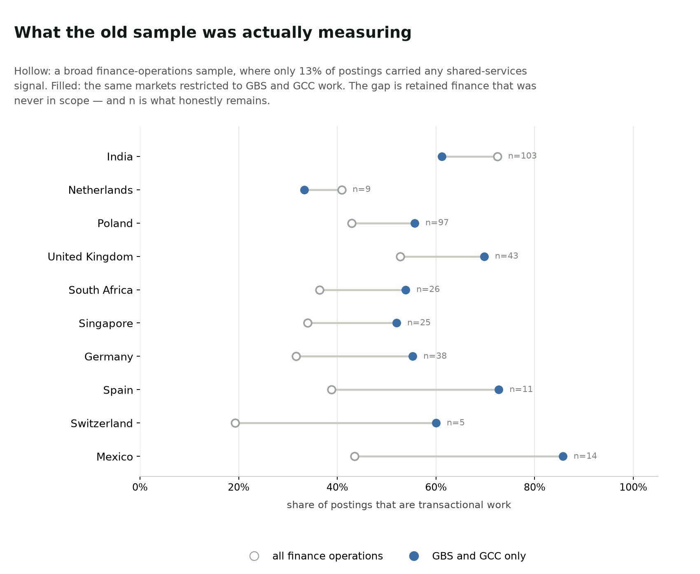
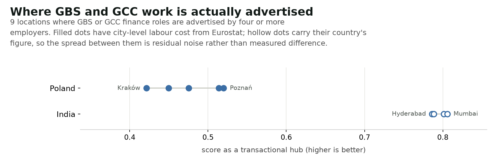

# gbs-location-selection

**A GBS and GCC location shortlist, and a measurement of how much of it was ever really in play.**

A location study arrives as three cities and a weighted scorecard. The weights
were set in a workshop, and the weights are what chose the three cities. The
study is then presented as measurement.

This scores eleven markets on seven pillars from public data, and then does the
part that is usually skipped: re-scores them ten thousand times under every
weighting somebody in that room could have defended, and reports how often each
market survives.



There is also an **[interactive dashboard](dashboard.html)** — `make dashboard`.
It ranks **cities only**: 13 places where GBS or GCC roles are actually
advertised by four or more employers. A location decision picks a city, and a
ranking that mixes cities with whole countries compares Kraków against Germany.
The country panel below is what those cities inherit their non-cost pillars
from, not a second ranking.

## Key finding

**The same panel answers one archetype's question and barely answers the other's.**

| | transactional hub | judgment centre of excellence |
|---|---|---|
| robust in the top 3 (≥90% of weightings) | **1** — India 100.0% | **1** — Germany 99.8% |
| never shortlisted (<10%) | 5 | 4 |
| baseline top three | India, United Kingdom, South Africa | Germany, Switzerland, Netherlands |

Exactly one market in each archetype survives a change of mind. Everything
below it is contingent on a weighting somebody chose, and should be presented
that way rather than as a ranking.

## What actually moves the ranking

Each row varies one thing and holds everything else fixed, reporting the largest
change it causes in any market's odds of making the shortlist.

| varied | transactional hub | judgment centre |
|---|---:|---:|
| **All published measurement error, combined** | 2.5pp | 12.0pp |
| Vintage — age-adjusted or as-observed | 11.9pp | 3.2pp |
| Normalisation — log or linear | 11.0pp | **57.4pp** |
| Talent pillar — employed stock or education pipeline | **34.4pp** | 22.9pp |

Every modelling choice in this table outweighs all of the measurement error
underneath it. Two of them change *who is on the list*, not merely how sure we
are:

- **Transactional hub** — employed-stock talent gives India, Mexico, **United
  Kingdom**; education-pipeline talent gives India, Mexico, **South Africa**.
- **Judgment centre** — employed-stock talent gives Germany, Switzerland,
  **Singapore**; education-pipeline talent gives Germany, Switzerland, **India**.

Neither construction is wrong. One counts people already doing the work, the
other counts the pipeline that might one day do it, and they disagree about the
third name on the shortlist. That decision gets made in a single line of code,
usually without discussion, and it matters more than every confidence interval
in the panel put together.

The governance result is worth stating on its own. Six of the nine adjacent
pairs in the governance ranking are separated by 0.7 to 3.4 points, while the
World Bank publishes standard errors of roughly 3.2 to 3.9 points on the
underlying dimensions. Singapore, Switzerland, the Netherlands and Germany are
not distinguishable from each other on governance at all, and the publisher says
so in the same file that carries the scores. Ranking them 1-2-3-4 on a scorecard
invents a precision the source explicitly disclaims.

## Poland: the fix that did not fix it

An earlier version of this study had four pillars, found that Poland — the
canonical European GBS location — was never shortlisted, and concluded that the
panel was blind to what Poland is actually bought for: overlapping working hours
with European headquarters.

So overlap was added as a pillar, and Poland scores the maximum on it.

Poland is still never shortlisted: 0.6% of transactional weightings, 4.9% of
judgment ones.

The reason is visible once the pillar exists. Poland ties four other markets on
that maximum overlap score, so the advantage separates it from nobody. And it
holds the worst durability score in the panel — measured wage drift of 8.5% a
year against India's 1.7% — so the cost gap it is chosen for is closing faster
than anyone else's. Poland is never best at anything.

That is a better answer than the first one, and it only appeared because the
missing pillar was added rather than written up as a caveat. The original
conclusion, that the model could not see Poland, was wrong.

## The four pillars

| pillar | source | what it is |
|---|---|---|
| Cost | [ILOSTAT](https://ilostat.ilo.org/topics/wages/) `DF_EAR_EMTA_SEX_OCU_CUR_NB` | Blended monthly wage basket across ISCO-08 major groups 2, 3 and 4, USD, carried forward to a common year at each market's own measured wage drift. |
| Talent | ILOSTAT `DF_EMP_2EMP_SEX_OCU_NB` | Employed stock in the same three ISCO groups, blended with the same staffing weights, so cost and talent describe one workforce. |
| Governance | [World Bank WGI](https://www.worldbank.org/en/publication/worldwide-governance-indicators) | Mean of five governance dimensions, each carrying the bounds of its own 90% confidence interval. |
| Capability | Adzuna, classified by `src/delivery.py` | What the market demonstrably staffs, from 537 live postings that are GBS or GCC work. |
| Overlap | computed | Hours of the market's working day that fall inside the headquarters' working day. Deterministic — no source to be stale. |
| Durability | ILOSTAT, derived | How slowly the wage gap has been closing in dollars. A cost advantage is not a fact about the future. |
| Employer depth | Adzuna, derived | Distinct employers advertising this work. Comparable only because the fetch applies identical effort everywhere *and* runs past the point where every market exhausts — see below. |

The capability pillar is the one that is not available off the shelf. Every
commercial location index measures talent *supply*. This measures what the
market actually hires for. The work-family taxonomy is loaded from the sibling
[gbs-agentic-shift](https://github.com/morichtereur/gbs-agentic-shift) study by
file path rather than reimplemented, so the two studies cannot drift apart on
what counts as transactional work — even though the sample underneath has been
replaced.

## Only GBS and GCC work counts

This study originally ran on a sample searched for "finance operations",
"record to report" and similar. Measured against its own result, **only 13% of
those 2,159 postings carried any shared-services or capability-centre signal**,
and eight mentioned a GCC. The capability pillar was describing retained finance
nine times out of ten — the work a GBS exists *not* to do.

The population is now fetched for the delivery model rather than the process,
and every posting passes two independent classifiers: one deciding whether it is
GBS or GCC work, one deciding whether that work is transactional or judgment.



Restricting the sample raises the transactional share in eight of ten markets,
because the dilution is gone. Switzerland moves from 19% to 60%, Mexico from 43%
to 86%. It also shows what honestly remains: Switzerland contributes five
decided postings, the Netherlands nine.

**India is the only real GCC market in this sample** — 28% of its in-scope
postings name a capability centre, against 7% in Mexico and zero everywhere
else.

### Precision is measured, not claimed

The delivery classifier is visible phrase lists, so a reader can disagree with a
specific entry. Sixty in-scope postings across three audits were adjudicated by
hand in [`eval/precision_audit.md`](eval/precision_audit.md): **precision is
roughly 55%**.

An earlier version of this README claimed 80%, from the first audit. That number
did not survive re-testing. Widening the classifier to read Portuguese raised
recall sharply — Brazil went from 7 recognised postings to 52 — and lowered
precision, and two further audits both landed near 55%. The 80% was a favourable
draw of twenty as much as it was a better classifier.

The failures are the useful part, and three rounds of fixes removed whole
categories of them: a hotel cashier, a municipal shared-services centre
recruiting a civil servant, an EHS manager whose employer's blurb listed finance
functions, and Singapore's sovereign wealth fund read as a capability centre
because "GIC" was in the acronym list. What survives is harder — retained group
and statutory work, which uses the same vocabulary as service-centre work and is
precisely the work a GBS exists not to move.

**That error is now modelled rather than noted**, and doing so changed a
conclusion. See below.

Recall is not measured and is certainly worse than precision. Adzuna truncates
every description at 500 characters, so a posting that identifies itself as
centre work further down is invisible to every gate. **All counts here are
floors.**

## Real GBS centres, not regions

An earlier version ranked NUTS-2 regions, which put Munich, Hamburg and
Amsterdam on a shared-services shortlist. Nobody places a delivery centre in
Munich. A location now qualifies only where GBS or GCC finance roles are
actually advertised by four or more employers.

The employer threshold does the work. Volume alone admits a Berlin district with
nine postings from one employer — that is a single company's office, not a
labour market. `make centres` prints the list and what the thresholds exclude.



That leaves **13 cities across four markets**:

| market | cities |
|---|---|
| Poland | Kraków, Wrocław, Warsaw, Poznań, Gdańsk, Łódź |
| India | Bangalore, Pune, Hyderabad, Mumbai, Chennai |
| Brazil | São Paulo |
| South Africa | Johannesburg |

Qualifying as a city and measuring its work mix are two different questions, and
they were wrongly answered by one number. A location is a centre if GBS roles
are advertised there by several employers — that is the delivery classifier's
job. Whether the *work-family* classifier could also read a given posting says
nothing about whether the city exists, and coupling the two hid São Paulo,
Johannesburg, Chennai and Łódź.

Germany, the UK, Singapore, Mexico, the Netherlands, Spain and Switzerland all
carry in-scope postings but too dispersed for any city to clear the thresholds.
That is a statement about fetch depth, not about those markets.

**The filter changes which city leads.** In the broad sample Warsaw dominated
Poland with 76 postings, because it is the country's largest finance job market.
On GBS and GCC work alone, Kraków leads — because it is the country's largest
*shared-services* market. Those are different questions with different answers,
and only the second one is a location decision.

### The tool can name Pune. It cannot rank it.

Nothing in the centre view is robust. Centres inside one country share every
pillar except capability, and often cost too, so the ranking between Pune and
Bangalore rests on a transactional share measured across twenty postings against
eighteen. Each centre's share is shrunk toward its country's in proportion to
how thin the evidence is, and the Monte Carlo redraws it from its own binomial.
What survives is that the centres are not separable, which is the honest answer
rather than a caveat on a false one.

Only the five Polish centres have city-level labour cost, from Eurostat's
regional accounts. India, and every other market outside the EU, has no
comparable public source, so its centres differ from each other on capability
alone.

## A cheap market may be a currency bet

ILOSTAT publishes the same earnings in local currency and in dollars, so the
drift behind the durability pillar can be split into what wages did and what the
exchange rate did. The two are different risks and they do not point the same
way.

| market | drift in USD | drift in local currency | currency effect |
|---|---:|---:|---:|
| Poland | 8.5% | 8.3% | +0.2pp |
| **India** | **1.7%** | **5.2%** | **−3.6pp** |
| **Brazil** | **1.5%** | **6.9%** | **−5.4pp** |
| Germany | 3.0% | 5.1% | −2.1pp |
| Switzerland | 2.2% | 0.7% | +1.5pp |

India and Brazil look like the most durable cost positions in the panel and are
nothing of the kind. Local wages are rising at 5–7% a year in both; a weakening
currency has been hiding it from a dollar buyer. Their apparent durability is a
bet on the rupee and the real staying where they are.

Poland is the opposite case, and the more honest one: its gap really is closing,
on wages, with no currency help either way. Switzerland is the only market where
the currency has made labour *more* expensive in dollars than local wages did.

The pillar still scores the dollar figure, because that is what a sponsor pays.
The split is reported so nobody mistakes a currency movement for wage restraint.

## The page cap was biasing a pillar

The employer-depth pillar rests on the fetch applying equal effort to every
market. The first version asserted the page cap did not bind, and that was
wrong. Probing each market for the page at which it stops returning results:

| exhausts after | markets |
|---|---|
| ~1 page | Switzerland, Netherlands |
| ~4 pages | Brazil, Mexico |
| ~8 pages | Spain, Singapore |
| ~12 pages | Poland, South Africa |
| ~20 pages | Germany |
| **still producing at 40** | **United Kingdom, India** |

A 14-page cap therefore truncated the largest markets and not the smallest, so
depth was understated for exactly the markets that have the most of it. Running
to 42 pages moved India from 62 employers to 70 and the United Kingdom from 32
to 39, and left Switzerland and the Netherlands untouched.

Two conditions keep this pillar honest and both have to hold: identical search
terms everywhere, and a cap high enough that no market is still producing when
it is reached.

## Modelling the classifier's error changed the answer

Classification error was a caveat for one revision too long. An observed
capability share is a mixture of the postings the classifier got right and the
ones it should never have admitted:

> observed = precision × true + (1 − precision) × contaminant

Both right-hand quantities were already measured: precision from the audits
(drawn per iteration from a Beta on 21 correct of 40, so the audit's own
uncertainty propagates), and the contaminant from the broad finance-operations
sample this study originally ran on — what an intruding posting most likely is,
per market.

Correcting for it barely moves the transactional ranking and **reverses the
judgment one**:

| judgment centre | ignoring classifier error | modelling it |
|---|---:|---:|
| Germany | **91%** | 67% |
| India | 78% | **92%** |
| Netherlands | 41% | 58% |

The direction has a cause. India's broad finance market is 72% transactional, so
a posting wrongly admitted there is probably processing work — which means the
observed judgment share for Indian centres was being *diluted downward*. Poland's
broad market is 43% transactional, so its intruders skew judgment and were
*inflating* Kraków and Wrocław. The correction pulls each back toward what the
service-centre postings alone imply.

**Germany was never robust as a judgment location. It looked robust because a
known error was left out of the model**, and the earlier version of this README
reported it as a finding. About 4% of draws are clipped at the bounds, which
biases the correction slightly toward the middle; `MODEL_CLASSIFICATION_ERROR`
in `src/config.py` turns it off for anyone who wants to see the uncorrected
figures.

## Everything that is resampled

The Monte Carlo varies four things at once, so a market's frequency is its
survival rate across all of them together:

- **Priorities** — 10,000 weightings drawn from a Dirichlet centred on the
  declared weights, so every draw is one somebody could argue for.
- **Governance** — each WGI dimension drawn inside its published 90% interval.
  The dimensions are drawn as perfectly correlated by default: no correlation
  matrix ships with WGI, and drawing them independently averages five errors
  down to a fifth of one and makes the composite look firmer than any dimension
  in it. The conservative end is the default; both are reported.
- **Staffing blend** — the ISCO mix behind the wage basket, applied identically
  to the talent basket so the model cannot buy a transactional wage bill for a
  judgment-heavy labour pool.
- **Capability sampling error** — the postings shares are sample proportions,
  from as few as 88 postings in Switzerland, and are redrawn from the binomial
  that produced them. Resampling everyone else's published error while treating
  this project's own measurement as exact would be the easier and less honest
  choice.

## What this cannot tell you

- **City-level cost reaches 15 of 26 centres**, and cost is the only pillar it
  resolves. Governance, talent, overlap and durability are national figures
  wearing a centre's name.
- **Centres are a point-in-time read of one posting snapshot.** A hub that
  happened to be hiring quietly during the fetch window is under-represented,
  and Katowice — a real Polish GBS location — appears with three postings and is
  excluded by the thresholds. Absence here is weak evidence, not a verdict.
- **One imputed number, flagged.** Wage observations are three to six years old
  in Germany, Singapore and South Africa, and are carried forward at each
  market's own measured drift. South Africa's series is too short to measure a
  drift, so it uses the panel median with a wider band — the single place a
  number is filled in rather than measured, and it is marked as such wherever it
  appears.
- **Modelled employment.** The talent pillar is an ILO modelled series, which
  buys complete coverage and a common reference year at the cost of being an
  estimate whose own error is not published per country. It also counts the
  national stock of professionals, technicians and clerks, not the
  finance-specific slice, which ILOSTAT does not resolve.
- **No language, tax or incentive pillar.** Language was measured from the
  postings and deliberately left unweighted: the detector reads English-language
  postings, and it returns 0% German for Switzerland on 94 postings, which is
  plainly a false negative rather than a finding. It is reported as a diagnostic
  and scores nothing. Tax and incentives are not covered at all.
- **The demand-side sample is censored.** The postings snapshot was fetched with
  a per-country page cap, so posting *counts* say nothing about market size.
  Every demand-side metric is a ratio within a country's own sample.
- **Point-in-time.** One snapshot cannot show a trend.
- **Six GBS markets are missing and the adapter for them is already written.**
  Romania, Czechia, Hungary, Portugal, the Philippines and Malaysia all have
  ILOSTAT cost and talent, World Bank governance, and the two derived pillars —
  five of seven pillars are ready. Only the postings feed is missing, and five
  sources were tested for it:

  | source | outcome |
  |---|---|
  | Adzuna | no endpoint for any of the six; returns 404 with valid credentials |
  | **EURES** | covers all six, and its **terms prohibit automated extraction for re-publication** — ruled out on terms, not on technique |
  | Arbeitnow | free and open, but German and UK applicant-tracking feeds only, and no keyword search |
  | Careerjet | legacy public API closed to new callers; v4 needs a commercial partnership |
  | OECD regional | 51 countries, none of the ones that would help: no regional rows at all for Brazil, India or Singapore |
  | **Jooble** | covers all six — but **refuses automated requests at the edge** |

  Jooble was the plan, and a valid key was obtained to test it. Every request
  returns an HTML 403 from Cloudflare, including a plain GET of the homepage:
  the block is on the client, not the credential, and the request never reaches
  the API. Working around bot protection is not something this project will do,
  so the adapter ships, detects the edge block, says so plainly instead of
  blaming the key, and the six markets stay out.

  `make fetch` attempts Jooble on every run and skips it with a message when no
  key is set, so the route is ready if the block ever lifts. Note that even
  then the gain is a better country panel, not more cities: Jooble returns no
  structured location field, so its postings cannot be resolved to a city and
  the ranking is city-only. **The Philippines remains a serious omission from a
  study about this decision, and there is currently no source that fixes it.**
- **Attrition is absent**, and it is probably the most important factor in a
  real GBS location decision. There is no free public source, and this
  repository would rather name the hole than fill it with a number nobody
  measured. Tax and incentives are missing for the same reason.
- **One snapshot so far.** `make trend` records each fetch under its own date
  and compares them; with a single snapshot it says so and stops rather than
  implying direction.
- **Thin markets are thin, not under-fetched.** Switzerland contributes five
  decided postings and the Netherlands nine, and probing the page depth at which
  each market stops returning results shows why: both exhaust after a single
  page. Deepening the fetch from 14 pages to 42 left them at exactly five and
  nine. That is scarcity in the source, and no amount of fetching fixes it.

## Run it

```
make install
make fetch      # adds a dated snapshot to the GBS/GCC sample (needs free Adzuna credentials)
make run        # rebuilds data/chart_stability.png and RESULTS.md
make dashboard  # rebuilds dashboard.html
make centres    # lists the evidenced GBS centres and what the thresholds exclude
make trend      # direction between snapshots
make test
```

### Keeping it current

`make refresh` does the whole cycle — new snapshot, rebuilt analysis and
dashboard, then the trend between snapshots. **Monthly is the right cadence**:
the postings feed turns over faster than that, and the ILOSTAT, World Bank and
Eurostat series behind the other pillars update annually, so more often adds
noise rather than information.

The second snapshot is the one that matters. Until it exists `make trend` says
so and stops; after it, the tool can answer whether a market is growing, which
is the question a location decision actually turns on and the one thing no
commercial index will tell you.

To have it happen without remembering, `crontab -e` and add — adjusting the path:

```
0 9 1 * * cd ~/Documents/gbs-location-selection && make refresh >> /tmp/gbs-refresh.log 2>&1
```

Every API pull is cached under `data/cache`, so a rerun is reproducible and does
not depend on three public services being up simultaneously. Full numbers in
[RESULTS.md](RESULTS.md); every declared judgement — weights, archetypes, the
staffing blend, the transform, the talent construction, the vintage handling —
is in [`src/config.py`](src/config.py) in one place, so a reader can disagree
with a specific number instead of with the conclusion.

## A note on the ILOSTAT bulk endpoints

ILOSTAT's documented bulk-download paths (`ilo.org/ilostat-files/WEB_bulk_download/...`)
return 404, and the `rplumber.ilo.org` indicator route returns HTTP 200 with an
empty body. The SDMX service at `sdmx.ilo.org/rest` is the route that works.
Recorded here because the documented path costs an hour before it fails.
